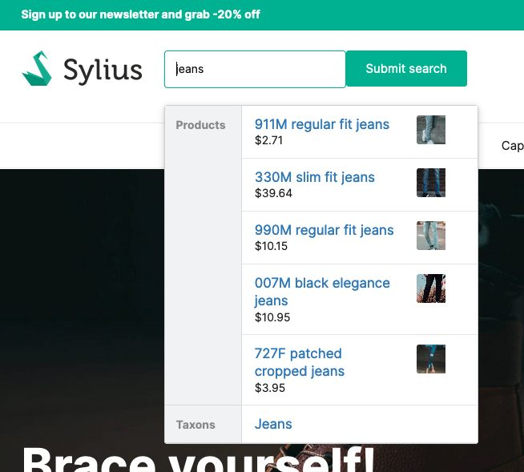
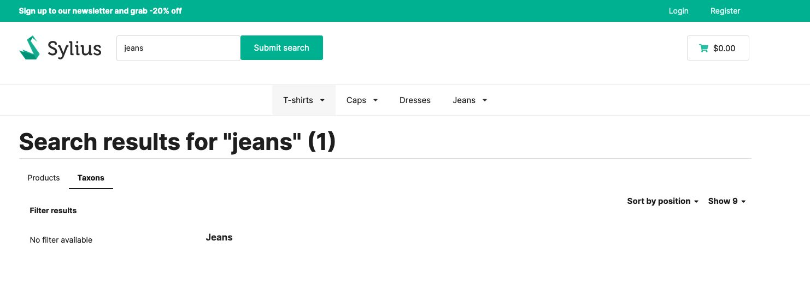

# Add custom entities

In our example, we will add taxons to the search results.

In the instant search :

In the search results, tabs will be displayed if you have many type of documents :

By clicking on the tab you will switch to the results of the selected type of document :

## Index your new entity in Elasticsearch

### Add your new entity as a type of document

[Declare your entity as a type of document for search](../dist/src/Resources/config/search/taxons.yaml).

- Use `instant_search_enabled` config to define if your entity should be displayed in the instant search.
- Use `position` config to change the order of the entity compared to each others.
- The `source` config is used to define the source of the data.
- The `target` config is used to define the target of the data, you can put a different sources in the same target for example if you want to mix some objects in the same page.
- The `templates` config node will define the templates used for the display of your document in the instant search and in the search page.
- The `datasource` allows you to change the way you retrieve the list of the documents to be indexed. In our example with taxons, we want only enabled taxons.

In the node `automapper_classes`, you have to define the source and the target classes of the data.
For our example, the source is the Sylius' taxon model, and the target in a custom DTO.
We will create the custom DTO later in the documentation.

### Declare the elastic search mapping

- [Add your elasticsearch config path in `monsieurbiz_sylius_search.elastically_configuration_paths`](../dist/config/packages/monsieurbiz_sylius_search_plugin.yaml#L9)
- [Declare the mapping of your entity for Elasticsearch](../dist/src/Resources/config/elasticsearch/app_taxon_mapping.yaml).

### Create the Datasource class if you defined a custom one

By default the [`MonsieurBiz\SyliusSearchPlugin\Model\Datasource\RepositoryDatasource`](/src/Model/Datasource/RepositoryDatasource.php) will be used and retrieve all results.
In our example we will retrieve all enabled taxons.  

[Create the TaxonDatasource class to retrieve enabled taxons](../dist/src/Search/Model/Datasource/TaxonDatasource.php).

### Create the Taxon DTO

This is the class used in `targets` of your `automapper_classes` configuration.

[Create the Taxon DTO](../dist/src/Search/Model/Taxon/TaxonDTO.php).

In our example, we use an Eater class which will allow us the `get` and `set` any value we want.
You can use a custom DTO with custom methods if you want.   

### Define a MapperConfiguration (optional)

We have to define how to populate the data from the model to the DTO object because we use a dynamic DTO which used Eater class.
You can use another automapper if you want and avoid this part.

[Create the TaxonMapperConfiguration](../dist/src/Search/Automapper/TaxonMapperConfiguration.php).

Be careful, the `public function getSource(): string` method must return the value of one of the `sources` defined in the `automapper_classes` configuration.  
Also, the `public function getTarget(): string` method must return the value of one of the `targets` defined in the `automapper_classes` configuration.

## Display your new entity in the search results

## Define your Instant Search request

If you want to display your entity in the instant search (`instant_search_enabled` is `true` in configuration).

[Declare your instant search request service](../dist/src/Resources/config/services.yaml#L60).

[Don't forget to bind the parameter for the service](../dist/src/Resources/config/services.yaml#L6).

## Define your Search request

[Declare your search request service](../dist/src/Resources/config/services.yaml#L67).

[Don't forget to bind the parameter for the service](../dist/src/Resources/config/services.yaml#L6).

You can extends the `MonsieurBiz\SyliusSearchPlugin\Search\Request\Search` class to manage your aggregations like in [products](../src/Search/Request/ProductRequest/Search.php).

## Define your Search query filter

[Declare your search query filter for instant search](../dist/src/Resources/config/services.yaml#L77).

[Declare your search query filter for search](../dist/src/Resources/config/services.yaml#L87).

You can extends the `MonsieurBiz\SyliusSearchPlugin\Search\Request\QueryFilter\SearchTermFilter` class to manage your custom behaviour like in [products](../src/Search/Request/QueryFilter/Product/SearchTermFilter.php).

## Add the templates for display

[Declare your templates for instant search](../dist/templates/bundles/MonsieurBizSyliusSearchPlugin/Instant/Taxon/_box.html.twig).

[Declare your templates for search](../dist/templates/bundles/MonsieurBizSyliusSearchPlugin/Search/Taxon/_box.html.twig).

## Add your document translation

[Declare your translations for your entity](../dist/translations/messages.en.yaml#L5).
